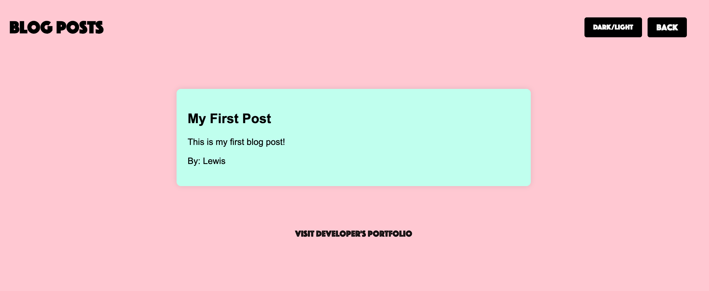
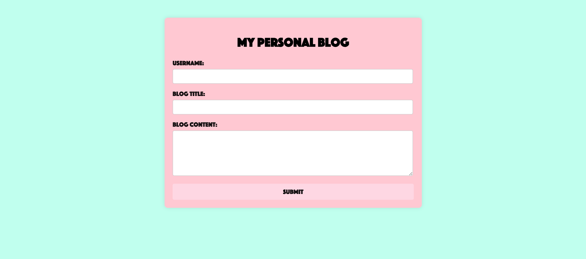

# My-Personal-Blog
My Personal Blog features a form page where the user is required to fill out their name, blog title, and blog content. Once they press submit they are redirected to the blog page where they will see their blog posts displayed. In the footer of the blog page is a link to my portfolio website.

